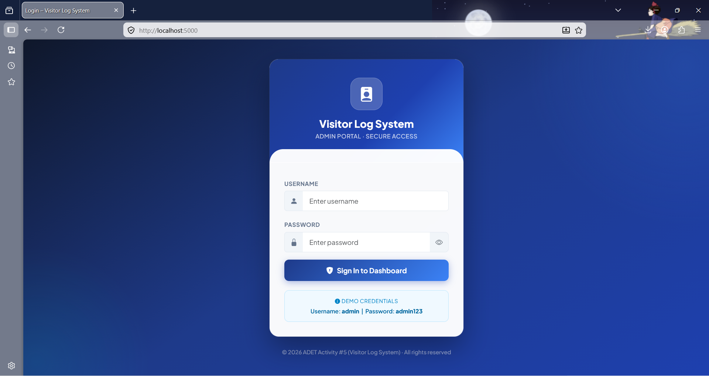

# Simple C# CRUD Application Development

The Visitor Log System is a simple application developed as part of an Application Development activity. It allows to records and manages visitor information using basic CRUD operations.

---

### Admin Login Page

